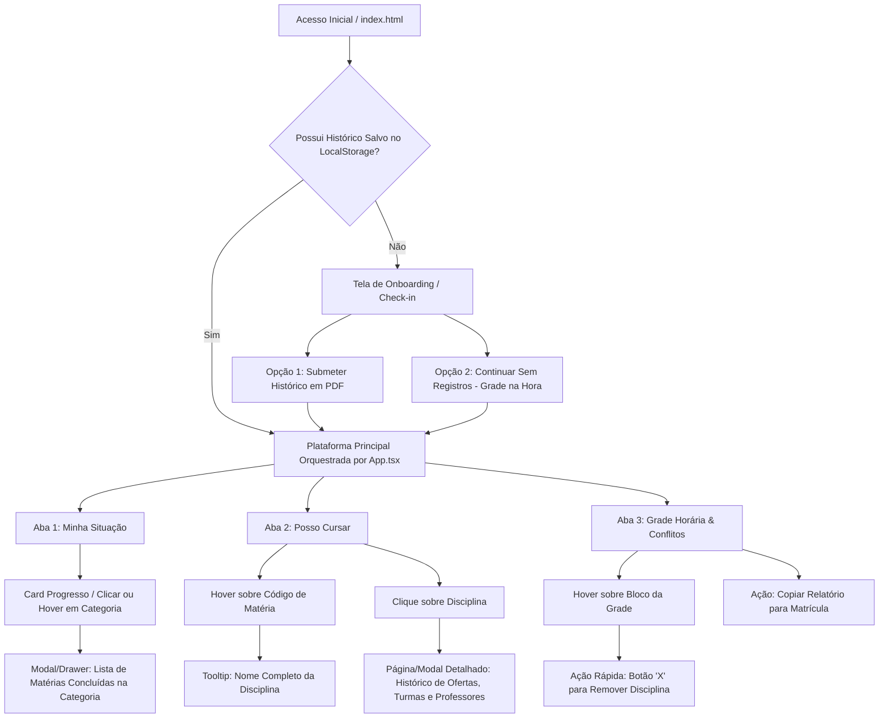

# Estrategia.md — Planejamento Estratégico, Gestão da Informação e IHC do Oásis UTFPR

Este documento consolida o **planejamento estratégico, documental e acadêmico** da plataforma **Oásis UTFPR**. Ele fundamenta as decisões de arquitetura de software, governança de dados e usabilidade, servindo como referência para expansão do produto e para trabalhos de conclusão de curso e relatórios de engenharia/sistemas de informação.

---

## 1. Engenharia de Requisitos

Abaixo estão listados os Requisitos Funcionais (RF) e Não Funcionais (RNF) da plataforma, marcando o estado de desenvolvimento (`[x]` Concluído, `[/]` Em andamento/Planejado imediato, `[ ]` Futuro/Backlog).

### Requisitos Funcionais (RF)
- `[x]` **RF01 — Ingestão de Histórico Escolar em PDF:** Permitir o upload e processamento local de arquivos PDF do Histórico Escolar emitidos pelo Portal do Aluno da UTFPR sem envio para servidores externos.
- `[x]` **RF02 — Cálculo e Apresentação de Progresso Curricular:** Calcular e exibir o progresso em horas e créditos dos estratos curriculares da Matriz 981 (Obrigatórias, 2º Estrato, Ciclo de Humanidades, Eletivas e Horas de Extensão).
- `[x]` **RF03 — Identificação de Disciplinas Elegíveis ("Posso Cursar"):** Cruzar disciplinas aprovadas com os pré-requisitos da matriz e turmas abertas do semestre para listar o que o aluno está liberado a cursar.
- `[x]` **RF04 — Montagem de Grade Horária e Detecção de Conflitos:** Permitir selecionar turmas e identificar em tempo real choques de horários e conflitos de deslocamento entre sedes (Centro, Ecoville, Neoville) em um mesmo turno.
- `[x]` **RF05 — Gerador de Relatório de Matrícola:** Copiar lista de códigos de turmas selecionadas formatadas para facilidade de digitação/busca durante a abertura da matrícula no Portal.
- `[x]` **RF06 — Portal de Configurações Centralizada:** Fornecer tela para alternação de tema (Claro/Escuro/Sistema), escolha de layout (Oásis vs GNH), alternância dos modos de planejamento do semestre (Prévia de Matrícula vs Período Corrido), atualização/limpeza de histórico e filtro em tempo real de conflitos.
- `[x]` **RF07 — Check-in e Modo Sem Submissão (Onboarding Resumido):** Permitir que o usuário utilize a plataforma sem submeter seu histórico (modo estilo *Grade na Hora*), selecionando previamente Câmpus, Curso e Matriz.
- `[x]` **RF08 — Feedbacks e Tooltips Visuais de Disciplinas:** Exibir o nome completo da disciplina em um tooltip ou revelação instantânea ao passar o mouse sobre códigos (ex.: `ICSW31`) e permitir inspecionar matérias concluídas em cada card de progresso via botões unificados de "Exibir Lista".
- `[/]` **RF09 — Página/Modal Detalhado de Disciplina:** Apresentar painel focado por disciplina contendo turmas abertas, histórico temporal de ofertas ("1º/2º Semestre do Ano"), horários típicos, professores e prioridade de vagas para BSI.
- `[ ]` **RF10 — Computação de Disciplinas Externas como Eletivas:** Mapear disciplinas de outros cursos cursadas por alunos de BSI e sugeri-las em catálogo colaborativo de eletivas/extensão.
- `[ ]` **RF11 — Linha do Tempo Curricular e Análise de Progressão Longitudinal (Comparativo Multi-Histórico):** Armazenamento de sucessivos históricos escolares no armazenamento local do navegador para medir progressão de créditos e variação temporal do Coeficiente de Rendimento (CR) e conclusão de trilhas.
- `[x]` **RF12 — Estados e Modos de Planejamento do Semestre:** Suporte aos dois estados essenciais de uso: a) *Prévia de Matrícula (Oficial)* para o período que antecede e sucede a matrícula com base nos dados reais divulgados; b) *Período Corrido de Semestre (Simulação)* para organização durante o semestre vigente hipotetizando ofertas similares.
- `[x]` **RF13 — Edição Contínua e Remoção Rápida na Grade (Loop Estilo GNH):** Botão "X" instantâneo revelado no hover de cada disciplina na minigrade lateral, no modal da grade completa e nos blocos da tabela visual de horários para remoção em um único clique sem perda de contexto.
- `[x]` **RF14 — Gamificação e Simulação de Impacto da Grade no Progresso:** Ao montar a grade do semestre, simular em tempo real o *impulso* que cada disciplina selecionada dá à integralização de cada categoria curricular (Obrigatórias, 2º Estrato, Humanidades, Trilhas, Eletivas, Extensão e Estágio), sobrepondo o cumprido do histórico ao previsto pela grade (`motor/progressoGrade.ts`), tornando visível o avanço que aquele semestre representa.
- `[ ]` **RF15 — Avaliações da Comunidade por Disciplina:** Permitir que o aluno registre dificuldade (1–3) e comentário nas disciplinas que já **concluiu** (validadas no próprio histórico), autenticado pelo próprio vínculo, redistribuindo a informação agregada aos demais usuários. Depende de decisão de infraestrutura (ver §5).

### Requisitos Não Funcionais (RNF)
- `[x]` **RNF01 — Privacidade e Local-First:** Todo parseamento de documentos pessoais ocorre no browser via `pdfjs-dist`. Nenhum histórico escolar transita por rede.
- `[x]` **RNF02 — Hospedagem Estática e Zero Backend:** A aplicação deve ser 100% estática e compatível com hospedagem em CDN/GitHub Pages sem dependência de bancos de dados ativos em runtime.
- `[x]` **RNF03 — Integridade e Invariantes de Dados (Erro Alto):** A ingestão de ofertas semestrais e matriz curricular deve passar por auditoria rigorosa via scripts Python (`validate_turmas.py`, `validate_matriz.py`), reprovando qualquer divergência documental com erro explícito (`0 erros`).
- `[x]` **RNF04 — Design Visual de Alta Fidelidade (Sem Emojis):** Interface limpa, minimalista e acessível com tipografia de produto (`Outfit` + `Plus Jakarta Sans`) e ícones vetoriais SVG, sem dependência de emojis ou fontes genéricas.
- `[x]` **RNF05 — Responsividade Absoluta:** O layout deve adaptar-se graciosamente a dispositivos móveis, tablets e monitores desktop amplos.
- `[/]` **RNF06 — Minimização de Dados e Autenticação por Vínculo (Camada de Comunidade):** Qualquer funcionalidade que exija troca com a rede (avaliações da comunidade) deve enviar o **mínimo indispensável** — nunca o RA em claro, notas, CR, nome do aluno ou o PDF do histórico — e ancorar a identidade em uma **prova de vínculo institucional** que iniba criação em massa de identidades (Sybil) e falsificação de RA, em conformidade com a LGPD (consentimento, finalidade e minimização). Ver §5.

---

## 2. Modelagem de Gestão da Informação (GI)

A arquitetura informacional do Oásis UTFPR é guiada pelos frameworks canônicos de Planejamento Estratégico de Negócios (PEN), Planejamento Estratégico de TI (PETI) e do Ciclo de Gestão da Informação (GI).

### 2.1 PEN — Planejamento Estratégico de Negócios
- **1.1 Análise do Cenário Atendido:** O Portal do Aluno da UTFPR apresenta interfaces fragmentadas, relatórios densos em texto (PDFs multicolecionados) e ausência de simulação preditiva de grade que alerte sobre choques de horários e deslocamento inter-sedes em tempo hábil durante o curto período de matrícula.
- **1.2 Definição de Objetivos:** Reduzir a carga cognitiva e o tempo gasto pelo estudante de BSI na tomada de decisão curricular de dias/horas para menos de 2 minutos, garantindo 100% de conformidade com a Matriz 981.
- **1.3 Definição da Estratégia:** Atuar como camada de inteligência e consolidação visual local sobre os documentos brutos da instituição, democratizando o acesso às regras de progressão sem competir com os sistemas oficiais de registro de notas.

### 2.2 PETI — Planejamento Estratégico de TI
- **2.1 Estratégia de TI:** Infraestrutura descentralizada (Client-side computing) alavancando a capacidade de processamento dos navegadores modernos para parsing e motor de inferência, com deploy contínuo via Git no GitHub Pages.
- **2.2 Elementos de TI Sugeridos:**
  - *Frontend & Build:* React 19, TypeScript, Vite, Tailwind CSS v4.
  - *Engine de Extração Posicional:* Python 3 + `pypdf`/`pdfplumber` (camada de build/análise offline de dados) e `pdfjs-dist` (camada de runtime no browser do usuário).
- **2.3 Indicadores de Desempenho (KPIs de TI):**
  - Taxa de sucesso no parseamento do Histórico Escolar em formato PDF (`>= 99.5%`).
  - Tempo de processamento do PDF no cliente (`< 1000ms`).
  - Zero falsos positivos ou omissões na detecção de choques de horário na grade.

### 2.3 Processo de GI — Ciclo de Vida da Informação

O ciclo de gestão da informação do Oásis UTFPR percorre quatro etapas canônicas — **Determinação das Exigências**, **Obtenção/Aquisição**, **Distribuição** e **Feedback** — atendendo a três perfis de agentes: o **Aluno de BSI** (usuário final), o **Aluno Contribuidor** (avaliador autenticado por vínculo, futuro) e os **Mantenedores/Administradores** (curadoria dos dados semestrais e moderação).

#### 3.1 Determinação das Exigências — *quem precisa de qual informação, e quando*

| Quem? | Informação Exigida | Quando? |
| :--- | :--- | :--- |
| **Aluno de BSI** | Quanto falta para integralizar cada estrato (obrigatórias, 2º estrato, humanidades, trilhas, eletivas, extensão, estágio)? Qual meu Coeficiente de Rendimento absoluto e normalizado? | Contínuo; pico ao fim do semestre |
| **Aluno de BSI** | Quais disciplinas estou liberado a cursar (pré-requisitos cumpridos × oferta do semestre)? | Períodos de matrícula e rematrícula |
| **Aluno de BSI** | Há choque de horário ou conflito de deslocamento entre sedes (Centro/Ecoville/Neoville) na grade que estou montando? Quanto esta grade me faz avançar? | Período de matrícula |
| **Aluno de BSI** | Qual a dificuldade percebida e a experiência de quem já cursou uma dada disciplina/turma? | Antes de escolher turmas |
| **Aluno Contribuidor** | Quais das minhas disciplinas concluídas posso avaliar, e como registrar dificuldade e comentário de forma autenticada? | Após concluir a disciplina |
| **Mantenedores** | Quais turmas foram abertas no semestre? A matriz sofreu alteração? Há avaliações da comunidade pendentes de moderação? | Semestral; contínuo para moderação |

#### 3.2 Obtenção e Plano de Aquisição da Informação — *qual dado, de qual fonte*

| Informação exigida | Dado a ser obtido | Fonte do dado |
| :--- | :--- | :--- |
| **Matriz curricular vigente (981)** | Disciplinas, período, conjunto/estrato, cargas horárias, pré-requisitos e equivalências | Consulta Curso e Matriz Curricular — Portal do Aluno UTFPR → `data/matriz-981.json` |
| **Oferta de turmas do semestre** | Códigos de turma, horários (turno M/T/N + slot), sede/sala, professores e prioridade BSI (S73 P1, S71 P2) | PDF oficial de Turmas Abertas — Portal do Aluno → `data/turmas/<sem>.json` |
| **Progresso individual do aluno** | RA, disciplinas cursadas, notas, frequência, status (aprovado/equivalência/aproveitamento/dependência) e créditos | Histórico Escolar em PDF — **processado 100% no navegador, sem trânsito em rede** |
| **Avaliação de disciplina pela comunidade** | Nível de dificuldade (1–3), comentário textual, código da disciplina e token de prova de vínculo | Submissão autenticada do Aluno Contribuidor (e-mail institucional + histórico validado localmente) — *futuro, ver §5* |

#### 3.3 Distribuição e Disponibilização da Informação — *quem recebe, e como*

| Quem? | Como? |
| :--- | :--- |
| **Aluno de BSI** | Abas **Minha Situação** (visão estratégica/longo prazo), **Planejamento de Matrícula** (posso cursar + grade + conflitos) e **Catálogo de Matérias**; tooltips de códigos; relatório copiável para o Portal; simulação gamificada de impulso da grade no progresso |
| **Aluno Contribuidor** | Botão **Avaliar** habilitado por disciplina concluída (validada no próprio histórico); painel de dificuldade média e comentários agregados por disciplina — *futuro* |
| **Mantenedores** | Pipeline de dados versionado (`data/` + validadores Python com erro alto); futuro portal de administração/moderação para homologar ofertas e avaliações sem editar JSON manualmente |

#### 3.4 Feedback da Utilização
- Alertas visuais imediatos de observações do parser e inconsistências (`perfil.avisos`, `painel.inconsistencias`).
- Badges dinâmicas de status da grade em tempo real (contagem de aulas/semana, *Sem conflitos* vs *Choque de horário*) e simulação de impulso no progresso curricular.
- Copiador de relatório de matrícula pronto para colagem no portal oficial.
- *Futuro:* fila de moderação de avaliações da comunidade e sinal de "dificuldade média" retroalimentando a decisão de escolha de turmas de outros alunos.

### 2.4 Dimensões e Atributos de Qualidade da Informação (QI)

Conforme a metodologia de avaliação de qualidade de dados do projeto, cada informação coletada é mensurada por dimensões e atributos rigorosos:

| Informação | Dado Coletado Avaliado | Dimensão Avaliada | Atributos Avaliados |
| :--- | :--- | :--- | :--- |
| **Disciplinas abertas no semestre vigente** | Matérias ofertadas no semestre (`data/turmas/<sem>.json`) | **d1: Atualidade** | **a1: intervalo de tempo** • **Alto:** se a informação é datada com intervalo máximo de até 2 meses antes do início do semestre letivo vigente. • **Baixo:** se a informação é datada com intervalo superior a 2 meses antes do início do semestre letivo vigente. |
| **Progresso no curso e integralização** | Histórico Escolar em PDF do aluno | **d2: Confiabilidade / Precisão** | **a2: fidelidade posicional** • **Alto:** se todas as linhas de disciplina possuem código, nome e carga horária perfeitamente alinhados e validados contra invariantes do curso (`0 erros`). • **Baixo:** se há falhas de parsing ou divergências em cargas horárias de dependências/equivalências. |
| **Horários e sedes das aulas** | Conflito de turno e sala (`motor/grade.ts`) | **d3: Integridade** | **a3: completeza relacional** • **Alto:** se cada slot da grade identifica sem ambiguidade dia, turno, aula, disciplina, turma e sala/sede. • **Baixo:** se há slots órfãos ou turmas sem indicação de sede para cálculo de deslocamento. |
| **Avaliações da comunidade** | Dificuldade (1–3) e comentário por disciplina (*futuro*) | **d4: Credibilidade / Autenticidade** | **a4: prova de vínculo** • **Alto:** se a avaliação está atrelada a um RA autenticado pela submissão do histórico e por verificação institucional, com no máximo uma avaliação por (aluno, disciplina). • **Baixo:** se a avaliação é anônima e não verificável, sujeita a spam, Sybil ou falsificação de RA. |

---

## 3. Diagramas de Uso e Navegação (Fluxo do Usuário)

O fluxo principal de navegação foi projetado para fluidez, minimizando cliques e eliminando becos sem saída:

---

## 4. Avaliação sobre Heurísticas e Princípios de IHC

A interface visual adota as **10 Heurísticas de Nielsen** e princípios modernos de **Interação Humano-Computador (IHC)** para proporcionar uma experiência de grau profissional e alta clareza:

1. **Visibilidade do Status do Sistema:**
   - Feedback instantâneo durante o upload e parseamento (`"Analisando o PDF..."`).
   - Badges dinâmicas na grade horária indicando contagem em tempo real (`4 aulas/semana` · `Sem conflitos` vs `Choque de horário`).
2. **Correspondência entre o Sistema e o Mundo Real:**
   - Utilização da nomenclatura oficial e familiar aos alunos da UTFPR (`1º Estrato`, `Coeficiente Normalizado`, `Turnos M/T/N`, `Sedes Centro/Ecoville/Neoville`).
3. **Controle e Liberdade do Usuário:**
   - Botões acessíveis para `Trocar Histórico`, `Limpar Grade` e futura remoção de matéria com um clique (`X`) direto na grade.
4. **Consistência e Padronização:**
   - Cores e tokens semânticos rigorosamente definidos em `index.css` (`--color-utfpr-*`, tons de verde para `ok`, âmbar para alerta e vermelho para erro/choque).
5. **Prevenção de Erros:**
   - Validação proativa: o motor impede visualmente ou destaca com clareza quando duas matérias chocam no mesmo slot ou exigem teletransporte entre Ecoville e Centro no mesmo turno.
6. **Reconhecimento em vez de Memorização:**
   - O usuário não precisa lembrar o nome da disciplina a partir da sigla `ICSW31`; tooltips visuais e sublinhados interativos revelam imediatamente as informações complementares.
7. **Estética e Design Minimalista:**
   - Eliminação de ruídos visuais e "Cara de IA" (remoção completa de emojis decorativos e fontes padrão).
   - Uso equilibrado de espaços em branco, cards com `backdrop-blur` e hierarquia tipográfica contrastando `Outfit` com `Plus Jakarta Sans`.

---

## 5. Arquitetura da Camada de Comunidade (Avaliações Autenticadas)

> **Status:** proposta em avaliação. **Não implementar sem homologação explícita do dono**, pois cruza a regra "Sem backend" do `CLAUDE.md`/RNF02. Esta seção registra o trade-off e a recomendação para essa decisão.

### 5.1 O problema e o teto de segurança
A ideia é: cada aluno cadastra seu histórico (como já ocorre, client-side) e, em cada disciplina **concluída** — fato que se valida no próprio histórico —, ganha um botão de avaliar (dificuldade 1–3 + comentário), com a review autenticada pelo RA e redistribuída a todos.

Há um limite honesto e incontornável: **o PDF do Histórico Escolar da UTFPR não possui assinatura digital verificável por terceiros.** Sem uma raiz criptográfica de confiança emitida pela instituição (SSO/OAuth institucional ou documento assinado), *qualquer* afirmação puramente client-side sobre "sou o RA X e passei na disciplina Y" é forjável — o cliente pode simplesmente mentir no `POST`. Portanto:
- **Não é possível** autenticar o RA de forma forte *sem* que algo saia do navegador **e** sem uma âncora institucional.
- O que é possível é elevar drasticamente o **custo de abuso** e obter segurança pragmática "boa o suficiente" com degradação graciosa.

### 5.2 A âncora recomendada: verificação por e-mail institucional (anti-Sybil)
Em vez de tentar provar o RA a partir do PDF, ancore a identidade no **e-mail institucional** (`@alunos.utfpr.edu.br`) via *magic-link*/OTP:
- Prova **vínculo institucional** sem o aluno digitar senha em lugar nenhum (não coletamos credencial).
- É o freio anti-Sybil: cada identidade falsa exigiria um e-mail institucional distinto, o que exige estar matriculado.
- O histórico local continua provando *quais* disciplinas o aluno concluiu; o e-mail prova *que ele é um aluno real da UTFPR*. A conjunção das duas dá: "um aluno verificado afirma ter concluído a disciplina X e a avalia".

### 5.3 Minimização de dados (RNF06) — o que trafega
Ler avaliações é anônimo e não exige nada. **Apenas para contribuir** o aluno se verifica uma vez. Por review, o cliente envia somente:
`{ codigoDisciplina, dificuldade(1–3), comentario, tokenVinculo }`.
- **Nunca** trafegam: RA em claro, notas, CR, nome, ou o PDF.
- **Anti-duplicação sem rastrear o RA:** derive no cliente um slot idempotente `slot = HMAC(tokenVinculoDoUsuario, codigoDisciplina)`. O servidor impõe **uma review por (usuário verificado, disciplina)** (upsert), sem nunca conhecer o RA.
- *Dial de privacidade opcional:* para o servidor **gatear** que só se avalia disciplina realmente cursada, o cliente pode divulgar apenas o **conjunto de códigos concluídos** (sem notas/nomes/RA). Isso vaza a lista de matérias feitas — custo de privacidade ajustável; se recusado, o "cursei de fato" volta a ser auto-declarado e a moderação assume esse papel.

### 5.4 Camadas anti-abuso (defesa em profundidade)
1. **Verificação institucional** = raiz anti-Sybil (identidades custam caro).
2. **Uma review por (usuário, disciplina)** = anti-spam estrutural (upsert idempotente).
3. **Rate limiting + fila de moderação** (automática e/ou manual) = anti-flood e anti-abuso textual.
4. **Segregação de camadas:** avaliar *dificuldade da disciplina* é de baixo risco; comentários *direcionados a professores* (TASK-08) carregam risco de difamação/LGPD e ficam em camada separada, com moderação reforçada.

### 5.5 Infraestrutura sugerida
- **Recomendado — BaaS gerenciado mínimo:** **Supabase** (magic-link/OTP e Row-Level Security nativos, Postgres) ou **Cloudflare Workers + D1/KV** (edge, mais enxuto e com hash do e-mail feito na hora para descartar o e-mail cru — mais privativo). Preserva o espírito "sem servidor para manter"; o histórico continua 100% client-side.
- **Alternativa zero-backend real:** se a linha "sem backend" for inegociável, avaliações compartilhadas robustas **não são viáveis**; recai-se no modelo *Git-como-banco* (reviews via PR/GitHub App a um repositório curado, identidade GitHub, moderadas) — casa com a TASK-10, mas **não** autentica RA.

### 5.6 Repositório público vs privado — não muda a segurança
Tornar o **repositório privado não ajuda** neste problema: a segurança depende do *runtime* (servidor + cliente), não da visibilidade do código-fonte. O front é código que roda no navegador do usuário — segredos jamais moram nele; segredos vivem apenas em variáveis de ambiente do BaaS (server-side), fora do Git. **Recomendação:** manter o repositório público (preserva o ethos open-source) e nunca versionar segredo algum.

### 5.7 Conformidade (LGPD)
Avaliações atreladas a vínculo institucional são tratamento de dado pessoal: exigem **consentimento explícito**, **finalidade declarada** e **minimização** — exatamente o que a arquitetura acima persegue ao não trafegar RA/notas/nome e ao descartar o e-mail após derivar o hash de unicidade.
