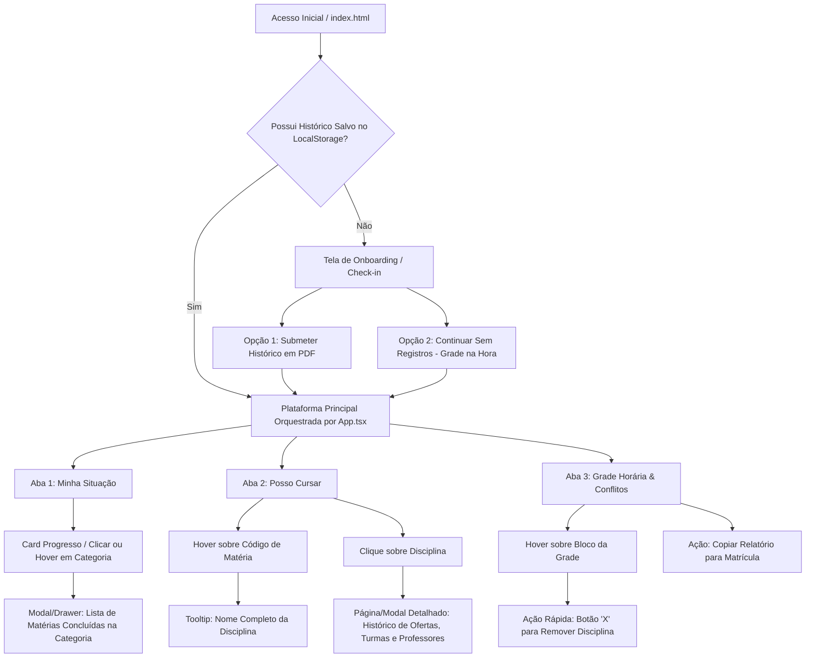

# Estrategia.md — Planejamento Estratégico, Gestão da Informação e IHC do Oásis UTFPR

Este documento consolida o **planejamento estratégico, documental e acadêmico** da plataforma **Oásis UTFPR**. Ele fundamenta as decisões de arquitetura de software, governança de dados e usabilidade, servindo como referência para expansão do produto e para trabalhos de conclusão de curso e relatórios de engenharia/sistemas de informação.

---

## 1. Engenharia de Requisitos

Abaixo estão listados os Requisitos Funcionais (RF) e Não Funcionais (RNF) da plataforma, marcando o estado de desenvolvimento (`[x]` Concluído, `[/]` Em andamento/Planejado imediato, `[ ]` Futuro/Backlog).

### Requisitos Funcionais (RF)
- `[x]` **RF01 — Ingestão de Histórico Escolar em PDF:** Permitir o upload e processamento local de arquivos PDF do Histórico Escolar emitidos pelo Portal do Aluno da UTFPR sem envio para servidores externos.
- `[x]` **RF02 — Cálculo e Apresentação de Progresso Curricular:** Calcular e exibir o progresso em horas e créditos dos estratos curriculares da Matriz 981 (Obrigatórias, 2º Estrato, Ciclo de Humanidades, Eletivas e Horas de Extensão).
- `[x]` **RF03 — Identificação de Disciplinas Elegíveis ("Posso Cursar"):** Cruzar disciplinas aprovadas com os pré-requisitos da matriz e turmas abertas do semestre para listar o que o aluno está liberado a cursar.
- `[x]` **RF04 — Montagem de Grade Horária e Detecção de Conflitos:** Permitir selecionar turmas e identificar em tempo real choques de horários e conflitos de deslocamento entre sedes (Centro, Ecoville, Neoville) em um mesmo turno.
- `[x]` **RF05 — Gerador de Relatório de Matrícola:** Copiar lista de códigos de turmas selecionadas formatadas para facilidade de digitação/busca durante a abertura da matrícula no Portal.
- `[x]` **RF06 — Portal de Configurações Centralizada:** Fornecer tela para alternação de tema (Claro/Escuro/Sistema), escolha de layout (Oásis vs GNH), alternância dos modos de planejamento do semestre (Prévia de Matrícula vs Período Corrido), atualização/limpeza de histórico e filtro em tempo real de conflitos.
- `[x]` **RF07 — Check-in e Modo Sem Submissão (Onboarding Resumido):** Permitir que o usuário utilize a plataforma sem submeter seu histórico (modo estilo *Grade na Hora*), selecionando previamente Câmpus, Curso e Matriz.
- `[x]` **RF08 — Feedbacks e Tooltips Visuais de Disciplinas:** Exibir o nome completo da disciplina em um tooltip ou revelação instantânea ao passar o mouse sobre códigos (ex.: `ICSW31`) e permitir inspecionar matérias concluídas em cada card de progresso via botões unificados de "Exibir Lista".
- `[/]` **RF09 — Página/Modal Detalhado de Disciplina:** Apresentar painel focado por disciplina contendo turmas abertas, histórico temporal de ofertas ("1º/2º Semestre do Ano"), horários típicos, professores e prioridade de vagas para BSI.
- `[ ]` **RF10 — Computação de Disciplinas Externas como Eletivas:** Mapear disciplinas de outros cursos cursadas por alunos de BSI e sugeri-las em catálogo colaborativo de eletivas/extensão.
- `[ ]` **RF11 — Linha do Tempo Curricular e Análise de Progressão Longitudinal (Comparativo Multi-Histórico):** Armazenamento de sucessivos históricos escolares no armazenamento local do navegador para medir progressão de créditos e variação temporal do Coeficiente de Rendimento (CR) e conclusão de trilhas.
- `[x]` **RF12 — Estados e Modos de Planejamento do Semestre:** Suporte aos dois estados essenciais de uso: a) *Prévia de Matrícula (Oficial)* para o período que antecede e sucede a matrícula com base nos dados reais divulgados; b) *Período Corrido de Semestre (Simulação)* para organização durante o semestre vigente hipotetizando ofertas similares.
- `[x]` **RF13 — Edição Contínua e Remoção Rápida na Grade (Loop Estilo GNH):** Botão "X" instantâneo revelado no hover de cada disciplina na minigrade lateral, no modal da grade completa e nos blocos da tabela visual de horários para remoção em um único clique sem perda de contexto.

### Requisitos Não Funcionais (RNF)
- `[x]` **RNF01 — Privacidade e Local-First:** Todo parseamento de documentos pessoais ocorre no browser via `pdfjs-dist`. Nenhum histórico escolar transita por rede.
- `[x]` **RNF02 — Hospedagem Estática e Zero Backend:** A aplicação deve ser 100% estática e compatível com hospedagem em CDN/GitHub Pages sem dependência de bancos de dados ativos em runtime.
- `[x]` **RNF03 — Integridade e Invariantes de Dados (Erro Alto):** A ingestão de ofertas semestrais e matriz curricular deve passar por auditoria rigorosa via scripts Python (`validate_turmas.py`, `validate_matriz.py`), reprovando qualquer divergência documental com erro explícito (`0 erros`).
- `[x]` **RNF04 — Design Visual de Alta Fidelidade (Sem Emojis):** Interface limpa, minimalista e acessível com tipografia de produto (`Outfit` + `Plus Jakarta Sans`) e ícones vetoriais SVG, sem dependência de emojis ou fontes genéricas.
- `[x]` **RNF05 — Responsividade Absoluta:** O layout deve adaptar-se graciosamente a dispositivos móveis, tablets e monitores desktop amplos.

---

## 2. Modelagem de Gestão da Informação (GI)

A arquitetura informacional do Oásis UTFPR é guiada pelos frameworks canônicos de Planejamento Estratégico de Negócios (PEN), Planejamento Estratégico de TI (PETI) e do Ciclo de Gestão da Informação (GI).

### 2.1 PEN — Planejamento Estratégico de Negócios
- **1.1 Análise do Cenário Atendido:** O Portal do Aluno da UTFPR apresenta interfaces fragmentadas, relatórios densos em texto (PDFs multicolecionados) e ausência de simulação preditiva de grade que alerte sobre choques de horários e deslocamento inter-sedes em tempo hábil durante o curto período de matrícula.
- **1.2 Definição de Objetivos:** Reduzir a carga cognitiva e o tempo gasto pelo estudante de BSI na tomada de decisão curricular de dias/horas para menos de 2 minutos, garantindo 100% de conformidade com a Matriz 981.
- **1.3 Definição da Estratégia:** Atuar como camada de inteligência e consolidação visual local sobre os documentos brutos da instituição, democratizando o acesso às regras de progressão sem competir com os sistemas oficiais de registro de notas.

### 2.2 PETI — Planejamento Estratégico de TI
- **2.1 Estratégia de TI:** Infraestrutura descentralizada (Client-side computing) alavancando a capacidade de processamento dos navegadores modernos para parsing e motor de inferência, com deploy contínuo via Git no GitHub Pages.
- **2.2 Elementos de TI Sugeridos:**
  - *Frontend & Build:* React 19, TypeScript, Vite, Tailwind CSS v4.
  - *Engine de Extração Posicional:* Python 3 + `pypdf`/`pdfplumber` (camada de build/análise offline de dados) e `pdfjs-dist` (camada de runtime no browser do usuário).
- **2.3 Indicadores de Desempenho (KPIs de TI):**
  - Taxa de sucesso no parseamento do Histórico Escolar em formato PDF (`>= 99.5%`).
  - Tempo de processamento do PDF no cliente (`< 1000ms`).
  - Zero falsos positivos ou omissões na detecção de choques de horário na grade.

### 2.3 Processo de GI — Ciclo de Vida da Informação
- **3.1 Determinação das Exigências:** Identificação precisa do que o aluno necessita saber para se matricular (falta quanto para formar? tem pré-requisito? tem choque de horário? qual a sala/sede?).
- **3.2 Obtenção da Informação:**
  - *Estática Canônica:* Extração e validação das tabelas de matriz (`matriz-981.json`) e turmas abertas (`turmas/2026-1.json`) a partir de relatórios institucionais oficiais.
  - *Dinâmica Individual:* Leitura em tempo real do histórico do aluno via upload de PDF.
- **3.3 Distribuição e Disponibilização da Informação:**
  - Segregação visual em 3 pilares intuitivos: **Minha Situação** (visão estratégica/longo prazo), **Posso Cursar** (visão tática/elegibilidade no semestre) e **Grade** (visão operacional/execução da matrícula).
- **3.4 Feedback da Utilização:**
  - Alertas visuais imediatos de observações do parser e inconsistências (`perfil.avisos`, `painel.inconsistencias`).
  - Copiador de relatório de matrícula pronto para colagem no portal oficial.

### 2.4 Dimensões e Atributos de Qualidade da Informação (QI)

Conforme a metodologia de avaliação de qualidade de dados do projeto, cada informação coletada é mensurada por dimensões e atributos rigorosos:

| Informação | Dado Coletado Avaliado | Dimensão Avaliada | Atributos Avaliados |
| :--- | :--- | :--- | :--- |
| **Disciplinas abertas no semestre vigente** | Matérias ofertadas no semestre (`data/turmas/<sem>.json`) | **d1: Atualidade** | **a1: intervalo de tempo** • **Alto:** se a informação é datada com intervalo máximo de até 2 meses antes do início do semestre letivo vigente. • **Baixo:** se a informação é datada com intervalo superior a 2 meses antes do início do semestre letivo vigente. |
| **Progresso no curso e integralização** | Histórico Escolar em PDF do aluno | **d2: Confiabilidade / Precisão** | **a2: fidelidade posicional** • **Alto:** se todas as linhas de disciplina possuem código, nome e carga horária perfeitamente alinhados e validados contra invariantes do curso (`0 erros`). • **Baixo:** se há falhas de parsing ou divergências em cargas horárias de dependências/equivalências. |
| **Horários e sedes das aulas** | Conflito de turno e sala (`motor/grade.ts`) | **d3: Integridade** | **a3: completeza relacional** • **Alto:** se cada slot da grade identifica sem ambiguidade dia, turno, aula, disciplina, turma e sala/sede. • **Baixo:** se há slots órfãos ou turmas sem indicação de sede para cálculo de deslocamento. |

---

## 3. Diagramas de Uso e Navegação (Fluxo do Usuário)

O fluxo principal de navegação foi projetado para fluidez, minimizando cliques e eliminando becos sem saída:

---

## 4. Avaliação sobre Heurísticas e Princípios de IHC

A interface visual adota as **10 Heurísticas de Nielsen** e princípios modernos de **Interação Humano-Computador (IHC)** para proporcionar uma experiência de grau profissional e alta clareza:

1. **Visibilidade do Status do Sistema:**
   - Feedback instantâneo durante o upload e parseamento (`"Analisando o PDF..."`).
   - Badges dinâmicas na grade horária indicando contagem em tempo real (`4 aulas/semana` · `Sem conflitos` vs `Choque de horário`).
2. **Correspondência entre o Sistema e o Mundo Real:**
   - Utilização da nomenclatura oficial e familiar aos alunos da UTFPR (`1º Estrato`, `Coeficiente Normalizado`, `Turnos M/T/N`, `Sedes Centro/Ecoville/Neoville`).
3. **Controle e Liberdade do Usuário:**
   - Botões acessíveis para `Trocar Histórico`, `Limpar Grade` e futura remoção de matéria com um clique (`X`) direto na grade.
4. **Consistência e Padronização:**
   - Cores e tokens semânticos rigorosamente definidos em `index.css` (`--color-utfpr-*`, tons de verde para `ok`, âmbar para alerta e vermelho para erro/choque).
5. **Prevenção de Erros:**
   - Validação proativa: o motor impede visualmente ou destaca com clareza quando duas matérias chocam no mesmo slot ou exigem teletransporte entre Ecoville e Centro no mesmo turno.
6. **Reconhecimento em vez de Memorização:**
   - O usuário não precisa lembrar o nome da disciplina a partir da sigla `ICSW31`; tooltips visuais e sublinhados interativos revelam imediatamente as informações complementares.
7. **Estética e Design Minimalista:**
   - Eliminação de ruídos visuais e "Cara de IA" (remoção completa de emojis decorativos e fontes padrão).
   - Uso equilibrado de espaços em branco, cards com `backdrop-blur` e hierarquia tipográfica contrastando `Outfit` com `Plus Jakarta Sans`.
