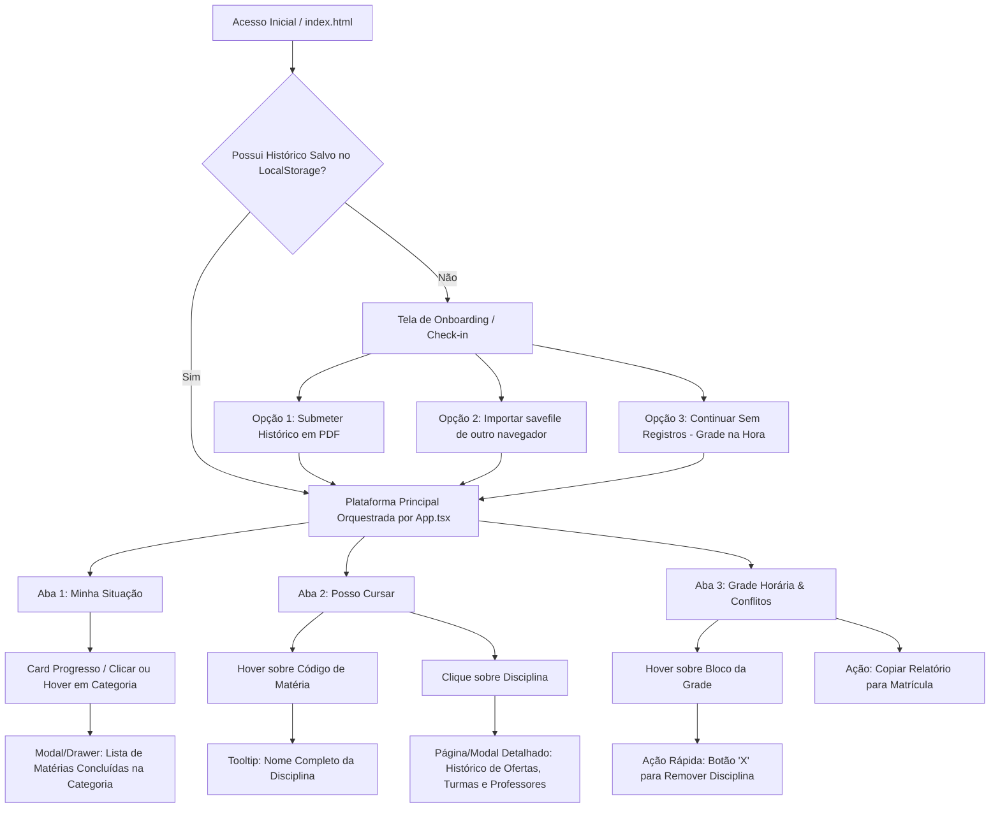

# Estrategia.md — Planejamento Estratégico, Gestão da Informação e IHC do Oásis UTFPR

Este documento consolida o **planejamento estratégico, documental e acadêmico** da plataforma **Oásis UTFPR**. Ele fundamenta as decisões de arquitetura de software, governança de dados e usabilidade, servindo como referência para expansão do produto e para trabalhos de conclusão de curso e relatórios de engenharia/sistemas de informação.

---

## 1. Engenharia de Requisitos

Abaixo estão listados os Requisitos Funcionais (RF) e Não Funcionais (RNF) da plataforma, marcando o estado de desenvolvimento (`[x]` Concluído, `[/]` Em andamento/Planejado imediato, `[ ]` Futuro/Backlog).

### Requisitos Funcionais (RF)
- `[x]` **RF01 — Ingestão de Histórico Escolar em PDF:** Permitir o upload e processamento local de arquivos PDF do Histórico Escolar emitidos pelo Portal do Aluno da UTFPR sem envio para servidores externos.
- `[x]` **RF02 — Cálculo e Apresentação de Progresso Curricular:** Calcular e exibir as categorias da matriz ativa: estratos, humanidades e extensão na BSI 981; obrigatórias, 270h optativas (duas trilhas completas mais optativas isoladas), eletivas e estágio na Engenharia de Computação 844.
- `[ ]` **RF02.1 — Engenharia de Computação 962:** A matriz 962 é a próxima expansão planejada. Sua opção pode ser anunciada no seletor, mas permanece indisponível até que dados oficiais, oferta e regras próprias estejam implementados e validados.
- `[x]` **RF03 — Identificação de Disciplinas Elegíveis ("Posso Cursar"):** Cruzar disciplinas aprovadas com os pré-requisitos da matriz e turmas abertas do semestre para listar o que o aluno está liberado a cursar.
- `[x]` **RF04 — Montagem de Grade Horária e Detecção de Conflitos:** Permitir selecionar turmas e identificar em tempo real choques de horários e conflitos de deslocamento entre sedes (Centro, Ecoville, Neoville) em um mesmo turno.
- `[x]` **RF05 — Gerador de Relatório de Matrícola:** Copiar lista de códigos de turmas selecionadas formatadas para facilidade de digitação/busca durante a abertura da matrícula no Portal.
- `[x]` **RF06 — Portal de Configurações Centralizada:** Fornecer tela para alternação de tema (Claro/Escuro/Sistema), escolha de layout (Oásis vs GNH), alternância dos modos de planejamento do semestre (Prévia de Matrícula vs Período Corrido), atualização/limpeza de histórico e filtro em tempo real de conflitos.
- `[x]` **RF07 — Check-in e Modo Sem Submissão (Onboarding Resumido):** Permitir que o usuário utilize a plataforma sem submeter seu histórico (modo estilo *Grade na Hora*), selecionando previamente Câmpus, Curso e Matriz.
- `[x]` **RF08 — Feedbacks e Tooltips Visuais de Disciplinas:** Exibir o nome completo da disciplina em um tooltip ou revelação instantânea ao passar o mouse sobre códigos (ex.: `ICSW31`) e permitir inspecionar matérias concluídas em cada card de progresso via botões unificados de "Exibir Lista".
- `[/]` **RF09 — Página/Modal Detalhado de Disciplina:** Apresentar painel focado por disciplina contendo turmas abertas, histórico temporal de ofertas ("1º/2º Semestre do Ano"), horários típicos, professores e prioridade de vagas para BSI.
- `[/]` **RF10 — Computação de Disciplinas Externas:** A ligação oficial entre oferta externa e matriz já é feita por código, equivalência ou nome, preservando a categoria correta (trilha, optativa isolada ou eletiva). Permanece futuro o catálogo colaborativo de sugestões da comunidade.
- `[ ]` **RF11 — Linha do Tempo Curricular e Análise de Progressão Longitudinal (Comparativo Multi-Histórico):** Armazenamento de sucessivos históricos escolares no armazenamento local do navegador para medir progressão de créditos e variação temporal do Coeficiente de Rendimento (CR) e conclusão de trilhas.
- `[x]` **RF12 — Estados e Modos de Planejamento do Semestre:** Suporte aos dois estados essenciais de uso: a) *Prévia de Matrícula (Oficial)* para o período que antecede e sucede a matrícula com base nos dados reais divulgados; b) *Período Corrido de Semestre (Simulação)* para organização durante o semestre vigente hipotetizando ofertas similares.
- `[x]` **RF13 — Edição Contínua e Remoção Rápida na Grade (Loop Estilo GNH):** Botão "X" instantâneo revelado no hover de cada disciplina na minigrade lateral, no modal da grade completa e nos blocos da tabela visual de horários para remoção em um único clique sem perda de contexto.
- `[x]` **RF14 — Gamificação e Simulação de Impacto da Grade no Progresso:** Ao montar a grade do semestre, simular em tempo real o *impulso* que cada disciplina selecionada dá à integralização de cada categoria curricular (Obrigatórias, 2º Estrato, Humanidades, Trilhas, Eletivas, Extensão e Estágio), sobrepondo o cumprido do histórico ao previsto pela grade (`motor/progressoGrade.ts`), tornando visível o avanço que aquele semestre representa.
- `[/]` **RF15 — Avaliações da Comunidade por Professor e Disciplina:** Permitir que o aluno avalie qualquer disciplina que já **concluiu**, por aprovação ou consignação (fato validado no próprio histórico local), tendo como chave o par **professor + disciplina + semestre cursado**. Reprovações, dispensas, cancelamentos, ENADE, estágio e atividades complementares não entram. Na consignação, o código original cursado identifica a experiência e o código canônico da matriz preserva o cruzamento com o Planejamento. Eletivas só entram na coleta quando possuem nome confirmado e uma oferta versionada com docente, pois a tabela própria do histórico não informa professor e o pipeline não publica unidades fora do roster; código ou docente incompletos não viram um alvo enganoso. Na rota geral de professor ausente da lista, o nome é exigido no Oásis e segue preenchido para triagem. Cada avaliação separa **Personalidade**, **Didática**, **Dificuldade** e **Carga de Trabalho** (1–5) para não tratar dificuldade alta como avaliação negativa. A submissão parte da tela de progresso ou do acionador no menu que lista todas as disciplinas elegíveis. O conjunto moderado é redistribuído publicamente. Ver §6.
- `[ ]` **RF16 — Convite de Avaliação Pós-Semestre:** Ao acessar a plataforma, o aluno que tiver histórico carregado recebe um convite único por semestre para avaliar as disciplinas cursadas no **último semestre do documento** (derivado de `periodoDocumento`). O convite é dispensável e não bloqueia o uso; o estado de "já respondido" é registrado por semestre, de modo que um novo semestre volta a convidar uma vez.
- `[ ]` **RF17 — Consulta de Avaliações no Planejamento de Matrícula:** No planejamento de matrícula, o nome do professor associado a uma turma é acionável e abre um painel lateral com as avaliações daquele professor — agregados por classificação, tags mais frequentes e comentários — permitindo decidir a turma com base na experiência da comunidade.
- `[x]` **RF18 — Savefile Portátil de Perfil e Planejamento:** Permitir baixar e importar, exclusivamente no navegador, um JSON versionado com o perfil já derivado do Histórico Escolar e as grades montadas. A importação fica disponível tanto no check-in inicial quanto nas Configurações, para que o arquivo possa realmente transportar a sessão a um navegador novo. O arquivo não contém o PDF original nem realiza transmissão em rede; antes da importação, o formato é validado e o aluno confirma a substituição dos dados locais.

### Requisitos Não Funcionais (RNF)
- `[x]` **RNF01 — Privacidade e Local-First:** Todo parseamento de documentos pessoais ocorre no browser via `pdfjs-dist`. Nenhum histórico escolar transita por rede.
- `[x]` **RNF02 — Hospedagem Estática e Zero Backend:** A aplicação deve ser 100% estática e compatível com hospedagem em CDN/GitHub Pages sem dependência de bancos de dados ativos em runtime.
- `[x]` **RNF03 — Integridade e Invariantes de Dados (Erro Alto):** A ingestão de ofertas semestrais e matriz curricular deve passar por auditoria rigorosa via scripts Python (`validate_turmas.py`, `validate_matriz.py`), reprovando qualquer divergência documental com erro explícito (`0 erros`).
- `[x]` **RNF04 — Design Visual de Alta Fidelidade (Sem Emojis):** Interface limpa, minimalista e acessível com tipografia de produto (`Outfit` + `Plus Jakarta Sans`) e ícones vetoriais SVG, sem dependência de emojis ou fontes genéricas.
- `[x]` **RNF05 — Responsividade Absoluta:** O layout deve adaptar-se graciosamente a dispositivos móveis, tablets e monitores desktop amplos.
- `[/]` **RNF06 — Minimização de Dados na Camada de Comunidade:** Qualquer funcionalidade que exija troca com a rede (avaliações da comunidade) envia o **mínimo indispensável**. Permanecem **proibidos de trafegar ou ser publicados**: o PDF do histórico, notas, frequências, CR e a lista de disciplinas reprovadas. O **RA** pode ser coletado para deduplicação e rastreio de abuso, mas fica **restrito ao estágio privado** do pipeline e **nunca** é publicado.
  - **Exceção homologada pelo dono (2026-08-02) — nome do autor:** o **nome completo** do aluno (ou o **nome social completo**, quando houver) **é publicado** junto da avaliação, revogando neste ponto específico a redação anterior deste requisito e da §5.3. Fundamento: avaliação assinada aumenta a responsabilidade de quem escreve e reduz o risco difamatório na camada de professor (§6.7). O ônus correspondente — consentimento explícito e canal de retratação — está no RNF07.
- `[ ]` **RNF07 — Consentimento, Retratação e Permanência do Versionamento:** Como a avaliação publicada é assinada e versionada em repositório público, o formulário deve apresentar **consentimento explícito e finalidade declarada** antes do envio, deixando claro que o nome ficará público. Deve existir **canal de retratação** que remova a avaliação das publicações seguintes. Limite honesto a comunicar ao usuário: a remoção **não apaga o histórico do Git** — commits anteriores permanecem; o que se garante é a saída das versões futuras. Ver §6.7.
- `[x]` **RNF08 — Identidade Pública e Compartilhamento:** Declarar metadados consistentes para o domínio canônico, nome do site, favicon e cartões sociais. A produção aponta para `oasisutfpr.com.br`; ambientes beta continuam com `noindex` e usam seus próprios endereços apenas nas prévias de compartilhamento.

---

## 2. Modelagem de Gestão da Informação (GI)

A arquitetura informacional do Oásis UTFPR é guiada pelos frameworks canônicos de Planejamento Estratégico de Negócios (PEN), Planejamento Estratégico de TI (PETI) e do Ciclo de Gestão da Informação (GI).

### 2.1 PEN — Planejamento Estratégico de Negócios
- **1.1 Análise do Cenário Atendido:** O Portal do Aluno da UTFPR apresenta interfaces fragmentadas, relatórios densos em texto (PDFs multicolecionados) e ausência de simulação preditiva de grade que alerte sobre choques de horários e deslocamento inter-sedes em tempo hábil durante o curto período de matrícula.
- **1.2 Definição de Objetivos:** Reduzir a carga cognitiva e o tempo gasto por estudantes de BSI e Engenharia de Computação na tomada de decisão curricular, respeitando as diferenças entre as matrizes 981 e 844.
- **1.3 Definição da Estratégia:** Atuar como camada de inteligência e consolidação visual local sobre os documentos brutos da instituição, democratizando o acesso às regras de progressão sem competir com os sistemas oficiais de registro de notas.

### 2.2 PETI — Planejamento Estratégico de TI
- **2.1 Estratégia de TI:** Infraestrutura descentralizada (Client-side computing) alavancando a capacidade de processamento dos navegadores modernos para parsing e motor de inferência, com deploy contínuo via Git no GitHub Pages.
- **2.2 Elementos de TI Sugeridos:**
  - *Frontend & Build:* React 19, TypeScript, Vite, Tailwind CSS v4.
  - *Engine de Extração Posicional:* Python 3 + `pypdf`/`pdfplumber` (camada de build/análise offline de dados) e `pdfjs-dist` (camada de runtime no browser do usuário).
- **2.3 Indicadores de Desempenho (KPIs de TI):**
  - Taxa de sucesso no parseamento do Histórico Escolar em formato PDF (`>= 99.5%`).
  - Tempo de processamento do PDF no cliente (`< 1000ms`).
  - Zero falsos positivos ou omissões na detecção de choques de horário na grade.

### 2.3 Processo de GI — Ciclo de Vida da Informação

O ciclo de gestão da informação do Oásis UTFPR percorre quatro etapas canônicas — **Determinação das Exigências**, **Obtenção/Aquisição**, **Distribuição** e **Feedback** — atendendo a três perfis de agentes: o **Aluno de BSI ou Engenharia de Computação** (usuário final), o **Aluno Contribuidor** (avaliador autenticado por vínculo, futuro) e os **Mantenedores/Administradores** (curadoria dos dados semestrais e moderação).

#### 3.1 Determinação das Exigências — *quem precisa de qual informação, e quando*

| Quem? | Informação Exigida | Quando? |
| :--- | :--- | :--- |
| **Aluno dos cursos atendidos** | Quanto falta para integralizar cada categoria da sua matriz? Qual meu Coeficiente de Rendimento absoluto e normalizado? | Contínuo; pico ao fim do semestre |
| **Aluno dos cursos atendidos** | Quais disciplinas estou liberado a cursar (pré-requisitos cumpridos × oferta do semestre)? | Períodos de matrícula e rematrícula |
| **Aluno dos cursos atendidos** | Há choque de horário ou conflito de deslocamento entre sedes (Centro/Ecoville/Neoville) na grade que estou montando? Quanto esta grade me faz avançar? | Período de matrícula |
| **Aluno dos cursos atendidos** | Qual a dificuldade percebida e a experiência de quem já cursou uma dada disciplina/turma? | Antes de escolher turmas |
| **Aluno Contribuidor** | Quais das minhas disciplinas concluídas posso avaliar, e como registrar dificuldade e comentário de forma autenticada? | Após concluir a disciplina |
| **Mantenedores** | Quais turmas foram abertas no semestre? A matriz sofreu alteração? Há avaliações da comunidade pendentes de moderação? | Semestral; contínuo para moderação |

#### 3.2 Obtenção e Plano de Aquisição da Informação — *qual dado, de qual fonte*

| Informação exigida | Dado a ser obtido | Fonte do dado |
| :--- | :--- | :--- |
| **Matrizes curriculares atendidas (981 e 844)** | Disciplinas, período, conjunto/categoria, cargas horárias, pré-requisitos e equivalências | Consulta Curso e Matriz Curricular — Portal do Aluno UTFPR → `data/matriz-981.json` e `data/eng-comp/matriz-844.json` |
| **Oferta de turmas do semestre** | Códigos de turma, horários (turno M/T/N + slot), sede/sala, professores e prioridades de curso | PDF oficial de Turmas Abertas — Portal do Aluno → `data/turmas/<sem>.json` e `data/eng-comp/turmas/<sem>.json` |
| **Progresso individual do aluno** | RA, disciplinas cursadas, notas, frequência, status (aprovado/equivalência/aproveitamento/dependência) e créditos | Histórico Escolar em PDF — **processado 100% no navegador, sem trânsito em rede** |
| **Avaliação de disciplina pela comunidade** | Nível de dificuldade (1–3), comentário textual, código da disciplina e token de prova de vínculo | Submissão autenticada do Aluno Contribuidor (e-mail institucional + histórico validado localmente) — *futuro, ver §5* |

#### 3.3 Distribuição e Disponibilização da Informação — *quem recebe, e como*

| Quem? | Como? |
| :--- | :--- |
| **Aluno de BSI** | Abas **Minha Situação** (visão estratégica/longo prazo), **Planejamento de Matrícula** (posso cursar + grade + conflitos) e **Catálogo de Matérias**; tooltips de códigos; relatório copiável para o Portal; simulação gamificada de impulso da grade no progresso |
| **Aluno Contribuidor** | Botão **Avaliar** habilitado por disciplina concluída (validada no próprio histórico); painel de dificuldade média e comentários agregados por disciplina — *futuro* |
| **Mantenedores** | Pipeline de dados versionado (`data/` + validadores Python com erro alto); futuro portal de administração/moderação para homologar ofertas e avaliações sem editar JSON manualmente |

#### 3.4 Feedback da Utilização
- Alertas visuais imediatos de observações do parser e inconsistências (`perfil.avisos`, `painel.inconsistencias`).
- Badges dinâmicas de status da grade em tempo real (contagem de aulas/semana, *Sem conflitos* vs *Choque de horário*) e simulação de impulso no progresso curricular.
- Copiador de relatório de matrícula pronto para colagem no portal oficial.
- *Futuro:* fila de moderação de avaliações da comunidade e sinal de "dificuldade média" retroalimentando a decisão de escolha de turmas de outros alunos.

### 2.4 Dimensões e Atributos de Qualidade da Informação (QI)

Conforme a metodologia de avaliação de qualidade de dados do projeto, cada informação coletada é mensurada por dimensões e atributos rigorosos:

| Informação | Dado Coletado Avaliado | Dimensão Avaliada | Atributos Avaliados |
| :--- | :--- | :--- | :--- |
| **Disciplinas abertas no semestre vigente** | Matérias ofertadas no semestre (`data/turmas/<sem>.json`) | **d1: Atualidade** | **a1: intervalo de tempo**<br>• **Alto:** se a informação é datada com intervalo máximo de até 2 meses antes do início do semestre letivo vigente.<br>• **Baixo:** se a informação é datada com intervalo superior a 2 meses antes do início do semestre letivo vigente. |
| **Progresso no curso e integralização** | Histórico Escolar em PDF do aluno | **d2: Confiabilidade / Precisão** | **a2: fidelidade posicional**<br>• **Alto:** se todas as linhas de disciplina possuem código, nome e carga horária perfeitamente alinhados e validados contra invariantes do curso (`0 erros`).<br>• **Baixo:** se há falhas de parsing ou divergências em cargas horárias de dependências/equivalências. |
| **Horários e sedes das aulas** | Conflito de turno e sala (`motor/grade.ts`) | **d3: Integridade** | **a3: completeza relacional**<br>• **Alto:** se cada slot da grade identifica sem ambiguidade dia, turno, aula, disciplina, turma e sala/sede.<br>• **Baixo:** se há slots órfãos ou turmas sem indicação de sede para cálculo de deslocamento. |
| **Avaliações da comunidade** | Dificuldade (1–3) e comentário por disciplina (*futuro*) | **d4: Credibilidade / Autenticidade** | **a4: prova de vínculo**<br>• **Alto:** se a avaliação está atrelada a um RA autenticado pela submissão do histórico e por verificação institucional, com no máximo uma avaliação por (aluno, disciplina).<br>• **Baixo:** se a avaliação é anônima e não verificável, sujeita a spam, Sybil ou falsificação de RA. |

---

## 3. Diagramas de Uso e Navegação (Fluxo do Usuário)

O fluxo principal de navegação foi projetado para fluidez, minimizando cliques e eliminando becos sem saída:


```mermaid
graph TD
    A[Acesso Inicial / index.html] --> B{Possui Histórico Salvo no LocalStorage?}
    B -- Não --> C[Tela de Onboarding / Check-in]
    C --> D[Opção 1: Submeter Histórico em PDF]
    C --> S[Opção 2: Importar savefile de outro navegador]
    C --> E[Opção 3: Continuar Sem Registros - Grade na Hora]
    B -- Sim --> F[Plataforma Principal Orquestrada por App.tsx]
    D --> F
    S --> F
    E --> F
    
    F --> G[Aba 1: Minha Situação]
    F --> H[Aba 2: Posso Cursar]
    F --> I[Aba 3: Grade Horária & Conflitos]
    
    G --> J[Card Progresso / Clicar ou Hover em Categoria]
    J --> K[Modal/Drawer: Lista de Matérias Concluídas na Categoria]
    
    H --> L[Hover sobre Código de Matéria]
    L --> M[Tooltip: Nome Completo da Disciplina]
    H --> N[Clique sobre Disciplina]
    N --> O[Página/Modal Detalhado: Histórico de Ofertas, Turmas e Professores]
    
    I --> P[Hover sobre Bloco da Grade]
    P --> Q[Ação Rápida: Botão 'X' para Remover Disciplina]
    I --> R[Ação: Copiar Relatório para Matrícula]
```

---

## 4. Avaliação sobre Heurísticas e Princípios de IHC

A interface visual adota as **10 Heurísticas de Nielsen** e princípios modernos de **Interação Humano-Computador (IHC)** para proporcionar uma experiência de grau profissional e alta clareza:

1. **Visibilidade do Status do Sistema:**
   - Feedback instantâneo durante o upload e parseamento (`"Analisando o PDF..."`).
   - Badges dinâmicas na grade horária indicando contagem em tempo real (`4 aulas/semana` · `Sem conflitos` vs `Choque de horário`).
2. **Correspondência entre o Sistema e o Mundo Real:**
   - Utilização da nomenclatura oficial e familiar aos alunos da UTFPR (`1º Estrato`, `Coeficiente Normalizado`, `Turnos M/T/N`, `Sedes Centro/Ecoville/Neoville`).
3. **Controle e Liberdade do Usuário:**
   - Botões acessíveis para `Trocar Histórico`, `Limpar Grade` e futura remoção de matéria com um clique (`X`) direto na grade.
4. **Consistência e Padronização:**
   - Cores e tokens semânticos rigorosamente definidos em `index.css` (`--color-utfpr-*`, tons de verde para `ok`, âmbar para alerta e vermelho para erro/choque).
5. **Prevenção de Erros:**
   - Validação proativa: o motor impede visualmente ou destaca com clareza quando duas matérias chocam no mesmo slot ou exigem teletransporte entre Ecoville e Centro no mesmo turno.
6. **Reconhecimento em vez de Memorização:**
   - O usuário não precisa lembrar o nome da disciplina a partir da sigla `ICSW31`; tooltips visuais e sublinhados interativos revelam imediatamente as informações complementares.
7. **Estética e Design Minimalista:**
   - Eliminação de ruídos visuais e "Cara de IA" (remoção completa de emojis decorativos e fontes padrão).
   - Uso equilibrado de espaços em branco, cards com `backdrop-blur` e hierarquia tipográfica contrastando `Outfit` com `Plus Jakarta Sans`.

---

## 5. Arquitetura da Camada de Comunidade (Avaliações Autenticadas)

> **Status (2026-08-02): NÃO é o caminho adotado.** O dono homologou a alternativa sem back-end descrita na **§6**, que mantém a RNF02 intacta. Esta seção permanece como registro da análise: ela documenta *por que* o caminho com back-end foi preterido e qual é o teto de segurança que nenhuma solução client-side ultrapassa (§5.1) — limite que continua valendo para a §6. Se algum dia a autenticação forte de RA virar requisito, é aqui que a discussão recomeça.

### 5.1 O problema e o teto de segurança
A ideia é: cada aluno cadastra seu histórico (como já ocorre, client-side) e, em cada disciplina **concluída** — fato que se valida no próprio histórico —, ganha um botão de avaliar (dificuldade 1–3 + comentário), com a review autenticada pelo RA e redistribuída a todos.

Há um limite honesto e incontornável: **o PDF do Histórico Escolar da UTFPR não possui assinatura digital verificável por terceiros.** Sem uma raiz criptográfica de confiança emitida pela instituição (SSO/OAuth institucional ou documento assinado), *qualquer* afirmação puramente client-side sobre "sou o RA X e passei na disciplina Y" é forjável — o cliente pode simplesmente mentir no `POST`. Portanto:
- **Não é possível** autenticar o RA de forma forte *sem* que algo saia do navegador **e** sem uma âncora institucional.
- O que é possível é elevar drasticamente o **custo de abuso** e obter segurança pragmática "boa o suficiente" com degradação graciosa.

### 5.2 A âncora recomendada: verificação por e-mail institucional (anti-Sybil)
Em vez de tentar provar o RA a partir do PDF, ancore a identidade no **e-mail institucional** (`@alunos.utfpr.edu.br`) via *magic-link*/OTP:
- Prova **vínculo institucional** sem o aluno digitar senha em lugar nenhum (não coletamos credencial).
- É o freio anti-Sybil: cada identidade falsa exigiria um e-mail institucional distinto, o que exige estar matriculado.
- O histórico local continua provando *quais* disciplinas o aluno concluiu; o e-mail prova *que ele é um aluno real da UTFPR*. A conjunção das duas dá: "um aluno verificado afirma ter concluído a disciplina X e a avalia".

### 5.3 Minimização de dados (RNF06) — o que trafega

> **Superada em parte (2026-08-02):** a regra "nunca trafega nome" abaixo foi **revogada para o campo nome** por decisão do dono — a avaliação é assinada com o nome completo público (ver RNF06 e §6.7). O restante da lista (RA em claro, notas, CR, PDF) continua valendo integralmente.
Ler avaliações é anônimo e não exige nada. **Apenas para contribuir** o aluno se verifica uma vez. Por review, o cliente envia somente:
`{ codigoDisciplina, dificuldade(1–3), comentario, tokenVinculo }`.
- **Nunca** trafegam: RA em claro, notas, CR, nome, ou o PDF.
- **Anti-duplicação sem rastrear o RA:** derive no cliente um slot idempotente `slot = HMAC(tokenVinculoDoUsuario, codigoDisciplina)`. O servidor impõe **uma review por (usuário verificado, disciplina)** (upsert), sem nunca conhecer o RA.
- *Dial de privacidade opcional:* para o servidor **gatear** que só se avalia disciplina realmente cursada, o cliente pode divulgar apenas o **conjunto de códigos concluídos** (sem notas/nomes/RA). Isso vaza a lista de matérias feitas — custo de privacidade ajustável; se recusado, o "cursei de fato" volta a ser auto-declarado e a moderação assume esse papel.

### 5.4 Camadas anti-abuso (defesa em profundidade)
1. **Verificação institucional** = raiz anti-Sybil (identidades custam caro).
2. **Uma review por (usuário, disciplina)** = anti-spam estrutural (upsert idempotente).
3. **Rate limiting + fila de moderação** (automática e/ou manual) = anti-flood e anti-abuso textual.
4. **Segregação de camadas:** avaliar *dificuldade da disciplina* é de baixo risco; comentários *direcionados a professores* (TASK-08) carregam risco de difamação/LGPD e ficam em camada separada, com moderação reforçada.

### 5.5 Infraestrutura sugerida
- **Recomendado — BaaS gerenciado mínimo:** **Supabase** (magic-link/OTP e Row-Level Security nativos, Postgres) ou **Cloudflare Workers + D1/KV** (edge, mais enxuto e com hash do e-mail feito na hora para descartar o e-mail cru — mais privativo). Preserva o espírito "sem servidor para manter"; o histórico continua 100% client-side.
- **Alternativa zero-backend real:** se a linha "sem backend" for inegociável, avaliações compartilhadas robustas **não são viáveis**; recai-se no modelo *Git-como-banco* (reviews via PR/GitHub App a um repositório curado, identidade GitHub, moderadas) — casa com a TASK-10, mas **não** autentica RA.

### 5.6 Repositório público vs privado — não muda a segurança
Tornar o **repositório privado não ajuda** neste problema: a segurança depende do *runtime* (servidor + cliente), não da visibilidade do código-fonte. O front é código que roda no navegador do usuário — segredos jamais moram nele; segredos vivem apenas em variáveis de ambiente do BaaS (server-side), fora do Git. **Recomendação:** manter o repositório público (preserva o ethos open-source) e nunca versionar segredo algum.

### 5.7 Conformidade (LGPD)
Avaliações atreladas a vínculo institucional são tratamento de dado pessoal: exigem **consentimento explícito**, **finalidade declarada** e **minimização** — exatamente o que a arquitetura acima persegue ao não trafegar RA/notas/nome e ao descartar o e-mail após derivar o hash de unicidade.

---

## 6. Pipeline de Avaliações sem Back-end (Arquitetura Homologada)

> **Status (2026-08-02):** caminho **homologado pelo dono**. Preserva a RNF02 — nenhum serviço em runtime, nenhum segredo versionado, custo zero em todos os estágios. Implementa RF15, RF16 e RF17.

### 6.1 Princípio: Git como banco de dados

A avaliação compartilhada exige *alguma* camada comum, mas não exige um servidor. O acordo é: **a coleta é externa e gratuita; a publicação é um artefato versionado no próprio repositório.** O site consome um JSON commitado, exatamente como já consome `data/turmas/<sem>.json`.

Consequência que sustenta a RNF02: **o site nunca fala com o Google em runtime.** Se a planilha cair, for apagada ou a automação falhar, a plataforma continua servindo o último estado bom. A dependência externa existe só no momento da ingestão semanal, offline, e sua falha é silenciosa e reversível.

### 6.2 Os quatro estágios e a fronteira de confiança

```
[1] Coleta        Formulário NATIVO no site → Apps Script  só na tela de quem tem histórico
[2] Bruto         Aba "Respostas" — NÃO publicada          contém RA; só o moderador vê
──────────────────────── fronteira de confiança ────────────────────────
[3] Curadoria     Aba "Homologado" — publicada como CSV    só linhas aprovadas, só colunas públicas
[4] Publicação    Action semanal → data/reviews.json       público e versionado
```

A fronteira fica **entre [2] e [3]**, não na entrada. É o que permite ser "público e aberto" sem publicar texto não moderado: o que é público é a *saída curada*.

**A fronteira é física, não convencional.** As duas abas vivem na mesma planilha, mas o recurso *Publicar na web* do Google Sheets opera **por aba**: só a `Homologado` recebe URL pública de CSV; a `Respostas` permanece acessível apenas a quem tem a planilha. A `Homologado` é gerada por fórmula (`FILTER`/`QUERY`) que seleciona **apenas as linhas com `aprovado`** e **apenas as colunas publicáveis** — o RA simplesmente não está entre as colunas projetadas. Logo o CSV público é, por construção, incapaz de conter RA ou linha não moderada; não se depende do validador para removê-los.

Erro a evitar: publicar a aba de respostas brutas. Isso exporia todo texto submetido no instante do envio, anulando o portão de moderação e publicando conteúdo potencialmente difamatório sem revisão.

### 6.3 Unidade de avaliação e esquema do registro

A unidade é o par **professor + disciplina + semestre**, e não a disciplina isolada: é isso que permite a consulta por professor da RF17 e reconhece que a mesma matéria muda completamente conforme quem a ministra.

```jsonc
{
  "id":            "hash estável da linha (idempotência da regeneração)",
  "professorId":   "slug do roster curado — ver 6.4; ausente enquanto pendente",
  "professorTexto": null,           // preenchido só na rota "Professor Não Ofertado"
  "codigo":        "ICSD20",
  "semestre":      "2025/2",        // ver 6.6: vem do histórico, não é digitado
  "situacao":      "aprovado",      // ou "reprovado" — contexto legítimo da opinião
  "autor":         "Nome Completo",  // ou nome social completo — RNF06
  "geral":         4,               // 1–5
  "didatica":      5,               // 1–5
  "dificuldade":   3,               // 1–5  (1 = fácil, 5 = difícil)
  "cargaTrabalho": 2,               // 1–5  (1 = pouca, 5 = muita)
  "avaliacao":     "provas",        // provas | trabalhos | misto
  "qtdProvas":     2,               // detalhamento OPCIONAL — ausente ≠ zero
  "qtdTrabalhos":  1,
  "tags":          ["corrige-rapido", "cobra-so-o-ensinado"],
  "comentario":    "texto livre, ≤ 1000 caracteres"
}
```

**Semestre (resposta ao cenário do item 8):** não é campo digitado nem inferido — `DisciplinaCursada` **já carrega `ano` e `semestre`** desde a ingestão do PDF, e a verificação nos históricos reais de referência confirmou **zero ausências** em 32 cursadas por documento, cobrindo de `2023/2` a `2026/1`. O site preenche o campo a partir do histórico e o validador o reconfere contra a oferta. Isso elimina a classe inteira de erro "aluno lembra errado do semestre" e é o que torna a chave `(professor, disciplina, semestre)` confiável.

**Situação:** `aprovado` ou `reprovado` também vêm prontos do parser. Manter essa marca é deliberado — a avaliação de quem reprovou é informação legítima e o leitor merece o contexto.

### 6.4 Identidade do professor — seleção a partir da oferta

**O professor é escolhido pelo aluno numa lista montada a partir das ofertas oficiais.** Quando o layout do histórico imprime o docente, o parser usa esse nome apenas para pré-selecionar a unidade correspondente no roster; a pessoa continua podendo corrigir a escolha. Quando o PDF não traz professor ou ele não existe nas ofertas versionadas, a seleção permanece manual, com a rota *Professor Não Ofertado*.

Duas razões sustentam a escolha:

1. **Relevância.** A avaliação só ajuda a decidir turma se o par professor + disciplina puder ser reencontrado por quem lê. Docente que não oferta mais aquela matéria não informa decisão.
2. **Robustez.** O elenco vem de `data/turmas/<sem>.json`, dado oficial já validado pelo pipeline (RNF03), com grafia canônica. Elimina toda a classe de erro da extração textual.

> **Registro da alternativa descartada.** A extração do professor pelo PDF **é tecnicamente viável** — a coluna `Situação/Professores` é padronizada e o pdf.js entrega `"Nome Completo - Titulação"` num único item, dispensando lógica posicional. Foi descartada por desnecessária, não por impossível. O modo de falha medido era truncamento por largura de coluna (2, 8 e 10 nomes cortados conforme a variante de export), benigno mas exigindo reparo por casamento de sufixo. Se algum dia o pré-preenchimento automático virar requisito, é por aqui.

#### A unidade avaliada é a turma, não a pessoa

Quando dois docentes dividem **a mesma turma no mesmo horário**, eles formam uma **unidade** e são avaliados juntos, exibidos como `Fulano / Sicrano`.

O motivo é semântico, não de conveniência: a didática, o sistema de avaliação e a carga que o aluno viveu são os da turma **como ela foi ministrada**. Deixar escolher só um dos dois obrigaria a atribuir a uma pessoa uma nota de didática que descreve a dupla — um dado que ninguém deu. Multi-seleção com notas compartilhadas teria o mesmo defeito, multiplicado.

- **Id da unidade:** slugs individuais **ordenados** e unidos por `+` (`fulano-de-tal+sicrano-da-silva`). A ordenação é obrigatória: a fonte lista os nomes na ordem que quiser, e sem ela a mesma dupla geraria ids diferentes conforme o semestre, fatiando o acervo de uma turma em dois.
- **Solo e dupla são unidades distintas.** Quem deu sozinho numa turma e acompanhado em outra gera duas entradas — foram duas experiências de aula diferentes, e não podem cair na mesma média.
- **A unidade é localizável por qualquer um dos seus membros**, então o painel de um docente ainda encontra as turmas em que ele lecionou em dupla. Elas aparecem numa seção própria, *fora* da média da unidade consultada, porque descrevem outro contexto.

#### Escopo da lista: união das ofertas cobertas

A lista usa a **união de todos os semestres cobertos** em que a disciplina aparece — não apenas o mais recente. Coleta ampla, filtragem na exibição: assim nada se perde quando um docente volta a ofertar depois de um semestre fora.

Medição nos históricos de referência sustenta a decisão: **127 de 128 cursadas** têm elenco disponível, porque as disciplinas se repetem entre semestres — quem cursou em 2024/1 encontra a matéria ofertada de novo em 2026/x.

#### O elenco não cobre todo mundo — e isso é caminho principal, não borda

A pergunta decisiva não é se a *disciplina* tem elenco, e sim se o *professor com quem a pessoa cursou* está nele. Cruzando os professores reais de cada histórico contra o elenco das ofertas cobertas:

| Histórico | professores no histórico | ausentes (elenco BSI) | ausentes (elenco global) |
| :--- | ---: | ---: | ---: |
| Aluna A (3 exports) | 25 / 21 / 22 | 0 / 0 / 0 | 0 / 0 / 0 |
| Aluna B (mais adiantada) | 36 | 6 (17%) | **4 (11%)** |

Para quem está no meio do curso, o elenco cobre **tudo**. A falha se concentra em quem está mais adiantado — semestres antigos e disciplinas de humanidades têm rodízio maior de docente. É um **piso**: a medição casa no nível de conjunto, enquanto na prática o aluno precisa do professor listado *naquela disciplina específica*, então a taxa real é maior.

> **Evidência para o elenco global (§6.11):** unir o elenco de **todos os cursos cobertos** — e não só o do curso do aluno — derruba a falha de 17% para 11% no caso mais adiantado. Professores lecionam em mais de um curso; o roster tem de ser global.

O escape, portanto, é minoria mas não é desprezível, e cresce com a senioridade de quem avalia — justamente quem tem mais o que dizer. Não pode ser beco sem saída.

#### "Professor Não Ofertado" — captura em texto livre + moderação

Quando o docente não estiver na lista, o aluno aciona **Professor Não Ofertado**, que abre um diálogo:

- Explica que a seleção significa que aquele professor **não consta na oferta atual nem na mais recente** daquela disciplina;
- Pede **confirmação** de que é esse o caso;
- Oferece contato pela constante `EMAIL_CONTATO` (`src/ui/telas/Contato.tsx`) caso não seja — nunca com o endereço repetido em literal;
- **Captura o nome do professor em texto livre.**

A avaliação é **aceita e retida**, marcada como pendente de roster. Na curadoria semanal o moderador confere o nome e o acrescenta ao **roster curado de docentes** em `data/`; a partir daí a avaliação passa a ser publicável e aquele professor entra na lista de seleção das próximas.

Efeito de longo prazo: o roster **cresce além da cobertura de ofertas**, alimentado exatamente pelos casos que faltavam. A taxa de escape cai sozinha conforme a plataforma é usada.

#### Identificador

`professorId` é um **slug normalizado** (minúsculas, sem acento, sem titulação), derivado do roster curado, com **mapa de apelidos** para variações de grafia entre fontes — o mesmo padrão que `motor/identidade.ts` já aplica a códigos de disciplina equivalentes. Enquanto pendente de moderação, a avaliação carrega o texto livre em vez do slug.

### 6.5 Taxonomia de tags — critério de admissão

**Regra:** toda tag precisa ser explicável por **comportamento observável**. Tags ancoradas em personalidade ("gente boa") são inadmissíveis: não são verificáveis, não ajudam a decidir turma e são exatamente a superfície de risco difamatório que a TASK-08 isola. Quando a intenção for elogiar postura, traduza para conduta observável.

As tags são agrupadas em quatro categorias — **Conteúdo e avaliação**, **Didática e material**, **Comunicação e trato** e **Rotina e prazos** —, o que reduz a lista a blocos legíveis e coloca cada par contraditório lado a lado.

**Pares opostos são mutuamente exclusivos.** Marcar *Acessível* e *Pouco acessível* juntas não é opinião matizada, é dado incoerente: ninguém teve um professor que respondia rápido e não respondia. A interface troca um pelo outro ao clicar, e as três camadas de validação recusam quem insistir. Os pares são `cobra-so-o-ensinado`/`cobra-alem-do-ensinado`, `acessivel`/`pouco-acessivel`, `chamada-rigorosa`/`chamada-flexivel`, `prazos-rigidos`/`aceita-atraso` e `corrige-rapido`/`corrige-devagar`.

| Tag | Comportamento observável que a justifica |
| :--- | :--- |
| `chamada-rigorosa` | Faz chamada com regularidade e aplica a reprovação por falta |
| `chamada-flexivel` | Não faz chamada sempre, ou aprova apesar de volume alto de faltas |
| `acessivel` | Mantém canal aberto e responde em prazo razoável fora de aula |
| `pouco-acessivel` | Comunicação difícil, demora ou não responde fora de aula |
| `trata-com-respeito` | Não expõe nem constrange aluno em público *(substitui "gente boa")* |
| `aberto-a-rever-nota` | Aceita e analisa pedido de revisão de correção |
| `cobra-so-o-ensinado` | A prova não traz assunto fora do que foi dado em aula e lista |
| `cobra-alem-do-ensinado` | A prova traz assunto não coberto em aula nem em lista |
| `slides-bastam` | O material publicado permite estudar sem assistir à aula |
| `corrige-rapido` | A nota sai antes da avaliação seguinte |
| `corrige-devagar` | A nota sai perto do fim do semestre |
| `prazos-rigidos` | Não aceita entrega fora do prazo |
| `aceita-atraso` | Há política explícita de entrega atrasada |
| `da-revisao-antes-da-prova` | Existe aula de revisão antes da avaliação |
| `oferece-substitutiva` | Existe segunda chance formal de avaliação |
| `trabalho-em-grupo-pesado` | Parcela relevante da nota depende de trabalho em grupo |
| `aula-pratica` | O tempo de aula é majoritariamente mão na massa |

### 6.6 Submissão restrita à plataforma e ingestão semanal

**Origem restrita (RF15).** O botão *Avaliar* só existe na tela de quem carregou o histórico, e só nas disciplinas concluídas por aprovação ou consignação. A consignação preserva duas identidades: o código original cursado alimenta nome, professor e formulário; o código canônico da matriz continua alimentando progresso, equivalências e Planejamento. Reprovações ficam fora.

**O formulário é nativo do site.** O aluno não sai da plataforma: a mesma tela que conhece o histórico monta o seletor de professor da §6.4, pré-preenche `codigo`, `semestre`, `situacao` e `turma`, apresenta o consentimento e o diálogo de *Professor Não Ofertado*, e valida antes de enviar.

Isso só é possível porque a coleta deixou de depender de um formulário de terceiro com campos fixos: uma lista de professores que muda por disciplina não cabe num Google Form, cujas opções são estáticas.

**O envio vai para um Apps Script publicado como Web App**, vinculado à planilha (`tools/apps-script/recebe-review.gs`). Ele é gratuito, hospedado pelo Google e sem infraestrutura a manter — mesma categoria de dependência que o formulário externo teria —, mas com duas vantagens decisivas:

- **Resposta real de sucesso ou erro.** Um POST direto ao endpoint do Google Forms é *fire-and-forget*: o CORS impede a leitura da resposta e o aluno nunca sabe se o envio valeu.
- **Validação antes de gravar.** O script rejeita nota fora de 1–5, tag fora do vocabulário, comentário acima do limite, ausência de consentimento, as duas rotas de professor preenchidas ao mesmo tempo, e aplica a guarda de PII e o freio de vazão da §6.9. É uma camada a mais **antes** da fronteira de confiança, não no lugar dela.

*Detalhe de implementação que quebra silenciosamente se ignorado:* o site envia `Content-Type: text/plain` com corpo JSON. Com `application/json` o navegador dispara um preflight `OPTIONS` que o Apps Script não responde, e a requisição falha inteira.

**Limite honesto:** a URL do endpoint é pública e aceita POST de quem a descobrir — exatamente como aconteceria com um formulário externo. A defesa real continua sendo o validador da fronteira (§6.6) somada à moderação; o script apenas encarece o abuso.

Limite honesto: uma URL de formulário conhecida **pode** receber envio direto. A restrição real não é o transporte, é o **validador na fronteira**, que rejeita a linha cujo `(código, turma, semestre)` não fecha com a oferta oficial. É defesa por validação, não por prevenção.

#### Da planilha ao site, coluna a coluna

A aba `Respostas` é criada pelo próprio Apps Script com este layout. A coluna `aprovado` é a que o moderador preenche:

| | A | B | C | D | E | F | G | H | I | J | K–N | O | P | Q | R | S | T | U |
| :-- | :-- | :-- | :-- | :-- | :-- | :-- | :-- | :-- | :-- | :-- | :-- | :-- | :-- | :-- | :-- | :-- | :-- | :-- |
| | carimbo | identidade | **ra** | autor | codigo | semestre | situacao | turma | professorId | professorTexto | notas | avaliacao | qtdProvas | qtdTrabalhos | tags | comentario | consentimento | **aprovado** |

A aba `Homologado` projeta **só o que é público**, e é ela — e só ela — que recebe URL de CSV:

```
=QUERY(Respostas!A:U; "select A,D,E,F,G,H,I,K,L,M,N,O,P,Q,R,S where U = 'SIM' and I <> ''"; 1)
```

Três coisas que essa fórmula garante por construção, sem depender de disciplina de ninguém:

- **`B` e `C` ficam de fora.** A identidade de quem enviou e o RA não estão entre as colunas projetadas, então o CSV público é *incapaz* de contê-los.
- **`where S = 'SIM'`** — nada não aprovado sai.
- **`and I <> ''`** — linha da rota *Professor Não Ofertado* só publica depois que o moderador escreve o `professorId` no lugar do texto livre, promovendo o docente ao roster.

**Regeneração total, nunca append.** A automação semanal reconstrói `data/reviews.json` **inteiro** a partir das linhas aprovadas. Com `id` estável por linha, o JSON é função pura da planilha: rodar duas vezes produz o mesmo resultado, e desaprovar uma linha a remove da próxima publicação. É a mesma disciplina dos parsers de `tools/`.

**Validador (RNF03, `0 erros`).** Implementado em `scripts/ingerir-reviews.ts`, no espírito de `validate_turmas.py`: **qualquer erro aborta a ingestão inteira e nada é publicado.**

Escrito em TypeScript, e não em Python como o resto de `tools/`, por correção: o vocabulário de tags, os limites e o tipo `Review` moram no domínio TS. Reimplementá-los em Python criaria duas fontes da verdade divergindo em silêncio — exatamente o que o validador existe para impedir.

*Estrutura do CSV:*
- colunas obrigatórias presentes;
- **colunas `ra` e `identidade` ausentes** — se aparecerem, a projeção da aba foi alterada e está vazando dado privado: recusa o CSV inteiro;
- parsing conforme RFC 4180, escrito à mão, porque o comentário é texto livre e pode conter vírgula, aspas e quebra de linha. Um `split(",")` corromperia essas linhas em silêncio.

*Coerência com o dado oficial — o que o Apps Script não consegue checar:*
- `codigo` existe em alguma matriz ou oferta versionada;
- `professorId` existe no **roster** construído a partir das ofertas de todos os cursos;
- linha sem `professorId` é **pendente de roster**: não publica e **não é erro** — fica aguardando a promoção pela moderação.

*Forma e vocabulário:*
- `semestre` em `AAAA/S`; `situacao` em aprovado/reprovado; `autor` não vazio;
- notas inteiras de 1–5; `avaliacao` no enum; tags no vocabulário fechado da §6.5;
- comentário dentro do limite de 1000 caracteres;
- **guarda de PII por regex** — RA de 7 dígitos, e-mail e telefone reprovam a linha.

*Determinismo:* o `id` é hash estável de `(carimbo, autor, codigo, semestre, professorId)`, e a saída é ordenada por ele. Rodar duas vezes produz byte a byte o mesmo arquivo, e `geradoEm` só avança quando o conteúdo muda de fato — sem isso o Action commitaria ruído toda semana.

**Limiar de exibição.** Agregado com N baixo mente: uma única avaliação vira "100%". Abaixo de um N mínimo, exibe-se o comentário mas **não** a estatística agregada. O valor exato é calibração de produto; a regra é estrutural.

### 6.7 Governança: consentimento, moderação e retratação

- **Consentimento (RNF07):** o formulário declara, antes do envio, que **o nome completo ficará público** e versionado, com a finalidade declarada de orientar a escolha de turmas.
- **Moderação semanal:** na ausência de verificação institucional, o moderador humano **é** a camada anti-abuso — ele substitui o anti-Sybil da §5.4. Rejeita ataque pessoal, conteúdo não verificável e PII de terceiros.
- **Camadas segregadas (TASK-08):** avaliação de *disciplina* e avaliação de *professor* permanecem streams distintos no mesmo pipeline, discriminados no registro, para que a de professor possa ter moderação mais rígida sem travar a outra.
- **Retratação:** desaprovar a linha na planilha remove a avaliação das publicações seguintes. **O histórico do Git não é reescrito** — isso é comunicado ao usuário no consentimento, não escondido.

### 6.8 Funcionamento diário

| Quando | Quem | O quê |
| :--- | :--- | :--- |
| Ao acessar após novo semestre | Aluno | Recebe **uma vez por semestre** (RF16) o convite para avaliar as disciplinas de `periodoDocumento`; o estado fica gravado por semestre, então o semestre seguinte convida de novo |
| A qualquer momento | Aluno | *Avaliar* disponível em toda disciplina concluída, na tela de progresso |
| Ao montar a grade | Aluno | Clica no professor da turma e abre o painel lateral com o agregado daquele docente (RF17) |
| 1× por semana | Moderador | Percorre as linhas novas na planilha privada e marca `aprovado` |
| 1× por semana, automático | GitHub Actions | Baixa o CSV, valida, regenera `data/reviews.json`, commita; o deploy existente publica |
| Sempre | Site | Lê o JSON versionado — sem rede, sem chave, sem custo |

### 6.9 Controle de abuso por volume — o que é e o que não é possível

**Bloqueio por IP não é implementável nesta arquitetura, e o motivo é anterior ao esforço: o dado não existe.** Duas razões independentes, ambas bloqueantes:

1. **Não há servidor nosso no caminho.** O site é estático e nunca recebe a submissão — ela vai direto do navegador do aluno para o formulário externo. Limitar por IP exige um ponto que veja a requisição e guarde estado entre requisições; a RNF02 exclui exatamente isso.
2. **O formulário não registra o IP do respondente.** Mesmo com um servidor nosso do lado de fora, o IP não é exposto ao dono do formulário. Não há o que ler.

**O endpoint de escrita também não tem como ficar oculto.** A URL do Apps Script precisa estar no JavaScript servido ao navegador; DevTools a revela. Repositório privado, repositório separado ou variável de ambiente não mudam isso — o Vite inlina `VITE_*` no bundle (§5.6). Assumir o contrário é o erro; o desenho parte de que a URL é conhecida.

**Raio de dano de quem a descobrir, e é aqui que a fronteira paga:** envios caem na aba **privada** e só viram acervo público depois de um humano marcar `aprovado`. Spam custa **tempo de moderação e cota**, não polui o site. O acervo público é imune por construção — a mesma propriedade que segura conteúdo difamatório.

O que **é** possível sem back-end, em camadas:

| Camada | Mecanismo | Alcance real |
| :--- | :--- | :--- |
| **Anti-robô** | **Cloudflare Turnstile**, com a chave secreta em *Script Properties* do Apps Script | Defesa efetiva contra bot. É o **único ponto de todo o desenho onde cabe um segredo**, porque as Script Properties são server-side de verdade, fora do bundle |
| Teto global | Contador por minuto em `CacheService`, somando todos os envios | Não depende de identidade: segura enxurrada e protege a cota do Apps Script e o tamanho da planilha |
| Identidade | Exigir Conta do Google na implantação + freio por conta e janela | **Degrada em silêncio:** numa implantação aberta a qualquer pessoa, `Session.getActiveUser().getEmail()` devolve vazio e o freio vira no-op. Só vale com login exigido e e-mail legível |
| Publicação | Portão de moderação semanal (§6.2) | Uma enxurrada gera muitas linhas **não aprovadas**: o custo é tempo do moderador, não conteúdo público |

Ou seja: o dano de um flood é **absorvido** pela fronteira de confiança, não evitado na origem. Nada não moderado chega ao público, por construção.

**Se o bloqueio por IP virar requisito firme**, é o gatilho para reabrir a §5: um *edge worker* (Cloudflare Workers + Turnstile) faz rate limiting por IP nativamente e cabe em faixa gratuita — mas isso reintroduz um serviço em runtime. A troca é precisa: preserva o **custo zero**, abandona o **back-end zero**.

### 6.10 Compartilhamento entre cursos

Uma avaliação de *Professor X em Estruturas de Dados* vale para quem cursa BSI e para quem cursa Engenharia de Computação — é a mesma pessoa dando a mesma matéria. O acervo, portanto, **não é particionado por curso**.

**Evidência no dado:** as ofertas já registram turmas compartilhadas. A turma `S73` de `ICSHX0` traz `prioridade_cursos: [Eng De Computação, Sist De Informação]` e `optativa_matrizes: ["981", "962"]` — um único professor, uma única turma, dois cursos.

Três consequências de arquitetura:

1. **Um único acervo.** `data/reviews.json` fica na raiz de `data/`, não sob a pasta de um curso. A chave `(professorId, código, semestre)` não é namespaced por curso.
2. **Roster global.** O elenco de docentes é construído a partir das ofertas de **todos** os cursos cobertos, não só o do aluno. Além de correto, é medível: reduz a falha de seleção de 17% para 11% (§6.4).
3. **Leitura resolve por equivalência.** Ao exibir avaliações de uma disciplina, o curso em que o leitor está resolve o código pelo seu próprio `MapaIdentidade` (`motor/identidade.ts`) e reúne as avaliações de **todos os códigos equivalentes**. Assim, se a mesma exigência curricular tem código distinto entre matrizes, o acervo continua único do ponto de vista de quem lê.

O primeiro curso a receber a interface é **BSI 981**, mas nada no formato do dado é específico dele: habilitar outro curso é ligar a tela, não migrar acervo.

**O recorte é de superfície, e vive num lugar só.** `MATRIZES_COM_REVIEWS`, em `src/domain/reviews/config.ts`, lista as matrizes cujo curso já expõe a camada — hoje `[981]`. Enquanto uma matriz não estiver ali, o aluno daquele curso não vê a seção de avaliar nem o painel de professor.

O que **não** é recortado: o acervo continua único e o roster segue sendo construído sobre as ofertas de **todos** os cursos, habilitados ou não. A consequência é a pretendida — no instante em que uma matriz entra na lista, os alunos dela já enxergam as avaliações escritas por alunos de outros cursos sobre os docentes que compartilham. Habilitar é uma linha; não há migração, reprocessamento nem acervo separado.

### 6.11 Limites honestos desta arquitetura

1. **Não autentica RA.** O PDF do histórico não tem assinatura verificável por terceiros (§5.1). O RA é autodeclarado: encarece a fraude e serve à moderação, não a impede.
2. **Anti-Sybil é humano.** Sem verificação institucional, a defesa contra enxurrada de avaliações falsas é a revisão semanal. Escala até certo volume; acima dele, a §5 volta à mesa.
   - **Sem rate limiting por IP** (§6.9): o formulário não expõe IP e não há servidor nosso no caminho. O que existe é throttle por identidade e absorção do flood na moderação.
3. **Latência de uma semana.** Por desenho — é o preço do portão de moderação e do custo zero.
4. **Publicação é permanente no Git.** Mitigada por consentimento explícito, não eliminável sem reescrever histórico.
